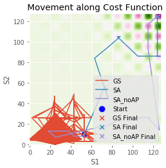
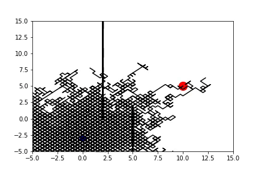
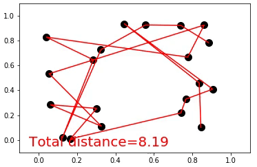
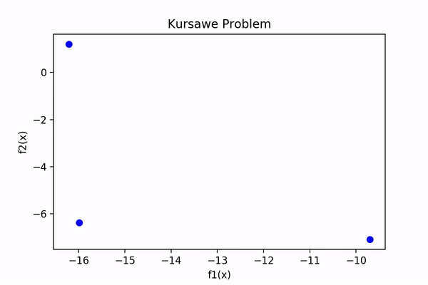
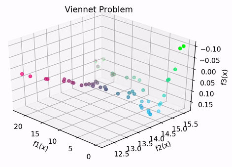
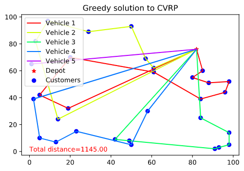
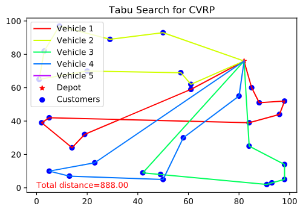
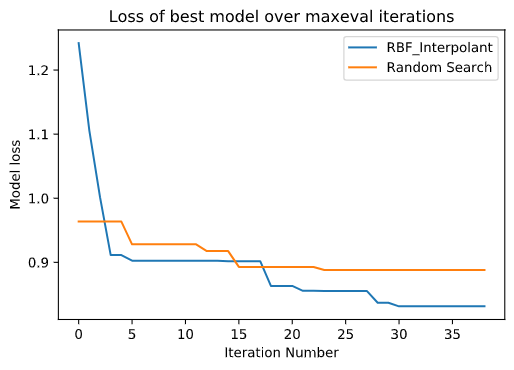

# Heuristic Global Optimization
Global optimization attempts to find the global minima / maxima of a function or set of functions. The functions may have more than one local minima and hence global optimization differs from local optimization in that it cannot be easily solved by using something like gradient descent. Moreover, in a lot of cases explicitly calculating the derivatives of the functions may be intractable.

**Heuristic** Global Optimization aims to solve the global optimization problem using heuristics to find an approximate solution, unlike classical algorithms which aim to find exact solutions. This repository aims to be a collection of such algorithms, providing both the theory behind the algorithms as well as Python implementations.

**Surrogate** Optimization goes one step further, with the goal of providing the best possible solution within the minimum number of function evaluations. This is especially useful when the function to be optimized can be computationally very expensive, for example, the loss of a neural network trained with a set of hyperparameters. Choosing the hyperparameters which minimize the loss function of a neural network within a given number of epochs is better done using surrogate optimization than random guessing.

## Currently Implemented Algorithms:
* Greedy Search / Random Search / Random Walk
* Simulated Annealing (with and without automatic parameter selection)
* Genetic Algorithms for Path Finding and Travelling Salesman Problem
* Multi Objective Optimization using Elitist Non-Dominated Sorting Genetic Algorithm (NSGA-II)
* Tabu Search for Travelling Salesman Problem and Capacitated Vehicle Routing Problem
* Dynamically Dimensioned Search (DDS)
* Using surrogate optimization to search for optimal hyperparameter set for a Neural Network

## Some visualizations
* **Simulated Annealing:** Below we see the comparison between simulated annealing (SA) and greedy search (GS) on an example objective. The search algorithm attempts to minimize the function based on two variables. In the image, green areas are maximas and purple areas are minimas, with the intensity representing magnitude.
  


* **Genetic Algorithsm**: Below shows the evolution of the solutions for two problems solved using genetic algorithms: path finding and travelling salesman problem:
  
<center>

 Path Finding          |  Travelling Salesman Probem
:-------------------------:|:-------------------------:
  |  
</center>

* **NSGA II**: Below shows the evolution of the pareto front for two benchmark multi objective optimization problems: Kursawe function and Viennet function (look at `6. Multi Objective Optimization & NSGA II.ipynb` for more details).
  
  
<center>

 Kursawe Function          |  Viennet Function
:-------------------------:|:-------------------------:
  |  
</center>

* **Tabu Search**: Below compares an optimal solution found using Tabu search vs. greedy search for the [Vehicle Routing Problem](https://en.wikipedia.org/wiki/Vehicle_routing_problem).

<center>

 Greedy Search          |  Tabu Search
:-------------------------:|:-------------------------:
  |  
</center>
  
* **Neural Network Hyperparameter Search:** Below shows a comparison in the loss of the best model achieved when optimizing hte hyperparameters of a neural network model. The NN model was trained to do text prediction for the works of Shakespeare. The hyperparameters to be optimized were: the embedding dimension, the number of GRU units per layer and the number of GRU layers.



## Running the Code
The code is available as separate Jupyter notebooks, which can be run independent on one another.

The `11. NN Hyperparameter Optimization.ipynb` notebook requires the `pySOT` package installed, which can be done using:
```shell
$ pip install pySOT
```

## Acknowledgements
The theoretical details for the algorithms have been taken from the course [Surrogate and Metaheuristic Global Optimization](https://ivle.nus.edu.sg/V1/lms/public/view_moduleoutline.aspx?CourseID=1D86508F-95B6-4BD2-AC09-6A895C581EBF&ClickFrom=StuViewBtn) offered in [NUS](http://www.nus.edu.sg), taught by [Prof. Christine Shoemaker](https://www.eng.nus.edu.sg/isem/staff/christine-a-shoemaker/). Prof. Shoemaker's team is also responsible for the development of the `pySOT` package.